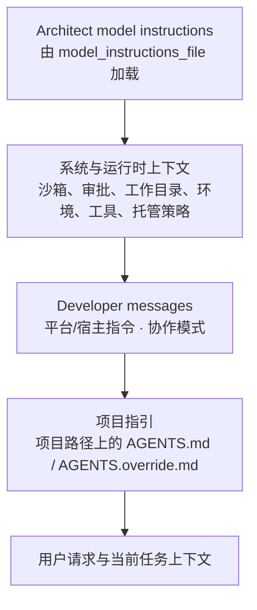

# Codex 提示词架构与 development 套件

本文说明 Codex 如何为一次任务组装提示词，以及本机 development 套件在其中的位置、部署方式和维护规则。

## 结论

development 套件的五个角色都以各自的 `model_instructions_file` 加载完整 Markdown 提示词，作为各自的 Base Instructions 覆盖来源。Codex 自己的运行时上下文、权限和多代理策略仍然生效。

这是有意选择：development 需要高度定制根代理，而项目 `.codex/config.toml` 中的 `developer_instructions` 不能作为 Desktop 任务的可靠注入层。

## 概念架构

以下是理解用的分层图，而非跨所有 Codex 表面都严格不变的消息排序。桌面端、CLI、IDE 和托管策略可以额外注入运行时消息；宿主安全策略始终不能被项目配置或角色提示绕过。



各层的职责如下：

| 层 | 用途 | 对 development 套件的含义 |
| --- | --- | --- |
| 模型 Base Instructions | 根代理的基础工作方式 | 由 Architect 的完整 Markdown 提示词替换；系统和运行时约束仍独立生效。 |
| 系统与运行时上下文 | 当前沙箱、审批、网络、工作目录、可用工具、宿主策略 | 权限的事实来源；角色提示不能提升权限。 |
| Developer messages | 宿主工作方式、协作模式，以及配置中的可选 `developer_instructions` | 本套件不以此层承载角色提示。 |
| 项目 `AGENTS.md` | 项目约定、验证命令、局部开发规则 | 独立于本套件；项目根到当前目录的多个文件会合并。 |
| 用户请求 | 此次工作的目标、范围和验收要求 | 由 Architect 分析、委派和验收。 |

同层消息的精确顺序会随 Codex 版本和使用表面变化，不能把图理解成可绕过的“后写覆盖前写”规则。出现冲突时，安全、宿主运行时和系统约束优先。

## `model_instructions_file` 与 `developer_instructions`

两者用途不同：

| 配置项 | Codex 行为 | 本套件的选择 |
| --- | --- | --- |
| `model_instructions_file` | 读取文件并作为 Base Instructions 覆盖来源。 | 用于 Architect、Coder、Lite、Reviewer 和 Rescue。 |
| `developer_instructions` | 作为独立 developer message 注入。 | 本套件不使用；可留给宿主或其他配置用途。 |

Codex 当前没有 `developer_instructions_file`。本套件统一直接引用 Markdown 文件，避免在 TOML 中复制任何角色提示词：

```toml
model_instructions_file = "~/.codex/prompt-suites/development/AGENTS.md"
```

每个角色的 Markdown 都是其唯一维护源；TOML 只保留模型、推理强度、sandbox 和 `model_instructions_file` 路径。

## development 套件的落点

```text
~/.codex/
├── config.toml                             # Desktop 的全局 Architect model_instructions_file
├── development.config.toml                 # CLI development profile；指向同一 Architect 源
├── agents/
│   ├── default.toml                         # 覆盖内置 default 的通用兜底配置
│   └── worker.toml                          # 覆盖内置 worker 的常规执行配置
└── prompt-suites/development/
    ├── AGENTS.md                            # Architect 的唯一维护源
    ├── agents/
    │   ├── Coder.md                         # Coder 的唯一维护源
    │   ├── Coder.toml                       # 模型、sandbox 与 Coder.md 路径
    │   ├── Lite.md / Lite.toml               # 快速、局部、低风险写入任务
    │   ├── Reviewer.md / Reviewer.toml
    │   └── Rescue.md / Rescue.toml
    ├── reviews/                             # 中英逐段审查稿；不是运行时输入
    └── scripts/validate-model-instruction-links.mjs
```

注意：`~/.codex/prompt-suites/development/AGENTS.md` 是 Architect 的唯一维护源。它由用户级 `~/.codex/config.toml` 的 `model_instructions_file` 直接加载；`development.config.toml` 为 CLI profile 指向同一文件。它不依赖项目 `AGENTS.md` 发现或项目 `.codex/config.toml` 注入。

### 角色配置

| 角色 | 维护源 | 运行时配置 | 模型 | Sandbox | 职责 |
| --- | --- | --- | --- | --- | --- |
| Architect | `AGENTS.md` | `~/.codex/config.toml` 的 `model_instructions_file` | 由当前根任务决定 | 根任务运行时决定 | 证据、设计、委派、验收；不直接写入。 |
| Coder | `agents/Coder.md` | `agents/Coder.toml` 的 `model_instructions_file` | `gpt-5.6-sol` | `workspace-write` | 根因、范围或安全方案不明的复杂、跨模块、高风险实施。 |
| Lite | `agents/Lite.md` | `agents/Lite.toml` 的 `model_instructions_file` | `gpt-5.4-mini` | `workspace-write` | 仅处理需求、目标文件和验收明确的局部、可逆、低风险快速改动；范围扩张、不确定或定向验证失败时交回 Architect 改派 Coder。 |
| Reviewer | `agents/Reviewer.md` | `agents/Reviewer.toml` 的 `model_instructions_file` | `gpt-5.6-sol` | `read-only` | 只读代码审查。 |
| Rescue | `agents/Rescue.md` | `agents/Rescue.toml` 的 `model_instructions_file` | `gpt-5.6-sol` | `read-only` | 反复失败或低信心根因分析的只读第二意见。 |
| worker | `~/.codex/agents/worker.toml` | 同名自定义配置覆盖内置 worker | `gpt-5.6-luna` | 继承父任务 | 目标、范围和验收已明确的常规有边界执行。 |
| default | `~/.codex/agents/default.toml` | 同名自定义配置覆盖内置 default | `gpt-5.6-luna` | 继承父任务 | 没有专属角色匹配时的一般性兜底。 |

Child TOML 中的 `sandbox_mode` 是子代理期望的配置；实际可写范围仍受宿主任务的沙箱和审批策略限制。

Architect 依据任务路由写入执行者：仅当需求、目标文件和验收明确，且改动局部、可逆、低风险并无跨模块、依赖、迁移、公共 API、认证/授权、并发、性能或数据影响时使用 Lite；问题、范围和验收已明确的常规实施使用 worker；根因、范围或安全方案不明，或涉及复杂、跨模块、高风险或设计取舍时使用 Coder。Lite 和 worker 不自行委派；它们报告范围扩张、不确定性或定向验证失败后，由 Architect 重新评估并在适当时改派 Coder。

## 多代理运行时策略

角色提示定义“允许委派时应如何分工”，但不自行授予委派权限。Codex 运行时还可能注入多代理策略：

| 策略 | 含义 |
| --- | --- |
| `ExplicitRequestOnly` | 仅在用户或适用的 `AGENTS.md` / Skill 明确要求时委派。 |
| `Proactive` | 主代理可在并行工作能实质提升速度或质量时主动委派。 |
| `Custom(...)` | 宿主提供自定义策略。 |

因此 Architect 的提示中有能力守卫：先遵循当前运行时的多代理策略和工具可用性；策略不允许委派时，不得绕过它，而应说明需要的明确请求或运行时配置。

## 项目部署

development 是全局维护的套件。Desktop 从用户级 `~/.codex/config.toml` 读取 Architect，因此项目不复制提示词，也不需要为了根代理创建 `.codex/config.toml` 软链接。

项目的 `.codex/config.toml` 只保留项目专属设置，例如受信任项目下的 sandbox、MCP、hooks 或模型默认值。若项目没有此类需求，可以没有该文件。已有指向 `development.config.toml` 的兼容软链接可保留，但不再是 Desktop 的提示词部署机制。

CLI 需要显式选用 development profile 时使用：

```sh
codex -p development
```

## 维护流程

1. 只编辑 Markdown 维护源，例如 `AGENTS.md`、`agents/Coder.md` 或 `agents/Lite.md`。
2. 同步对应的 `reviews/*-bilingual-review.md`：每段英文原文必须紧接中文审查译文。
3. 只读校验各角色 TOML 是否仍直接引用对应 Markdown、worker/default 覆盖配置是否完整，以及 development CLI profile 的固定 Architect 路径和 `[agents]` 配置：

   ```sh
   node ~/.codex/prompt-suites/development/scripts/validate-model-instruction-links.mjs
   ```

4. 严格解析 development CLI profile：

   ```sh
   codex --strict-config -p development exec --help
   ```

   该命令会严格解析 development profile；成功时仅显示 help 也属预期。

   可选地，使用下列命令诊断 Desktop / 全局根提示词配置：

   ```sh
   codex debug prompt-input
   ```

   该诊断验证配置可被读取，但不会在其 message 列表中展开 Base Instructions；它不替代对 development CLI profile 的严格解析。`model_instructions_file` 的文件路径与 Markdown 内容是根提示词的可审查来源。Desktop 改动从新建任务开始生效。

## 设计边界

- Architect 覆盖 Base Instructions，因此其提示词保留根代理工作所需的完整角色规则；系统、运行时安全策略和项目 `AGENTS.md` 仍不能被它绕过。
- 不在角色提示中声明或假定高于运行时的文件写入、网络、审批或多代理权限。
- 用项目 `AGENTS.md` 放项目事实、命令和惯例；用 development 套件放跨项目的角色工作方式。
- 双语审查稿服务于人工审查，不参与模型运行时。
- 校验脚本仅以只读方式验证 model instruction 路径引用、`developer_instructions` 未残留，以及 development CLI profile 的固定 Architect 路径和 `[agents]` 配置；它不会同步、规范化或写入文件。Markdown 才是语义上的唯一维护源。

## 实现依据与版本说明

本文按本机于 2026-07-17 审查的 Codex 源码 `315195492c80fdade38e917c18f9584efd599304` 整理。相关实现可在 [配置组装](https://github.com/openai/codex/blob/315195492c80fdade38e917c18f9584efd599304/codex-rs/core/src/config/mod.rs#L683-L684)、[Base 与 developer 配置解析](https://github.com/openai/codex/blob/315195492c80fdade38e917c18f9584efd599304/codex-rs/core/src/config/mod.rs#L3714-L3725)、[多代理策略](https://github.com/openai/codex/blob/315195492c80fdade38e917c18f9584efd599304/codex-rs/protocol/src/config_types.rs#L305-L329) 和 [项目 AGENTS.md 发现](https://github.com/openai/codex/blob/315195492c80fdade38e917c18f9584efd599304/codex-rs/core/src/agents_md.rs#L1-L15) 查看。

Codex 的消息组装和桌面端运行时会持续演进。升级 Codex、调整模型或发现新的宿主策略后，应重新运行 `codex debug prompt-input`，并按需要更新本文。
